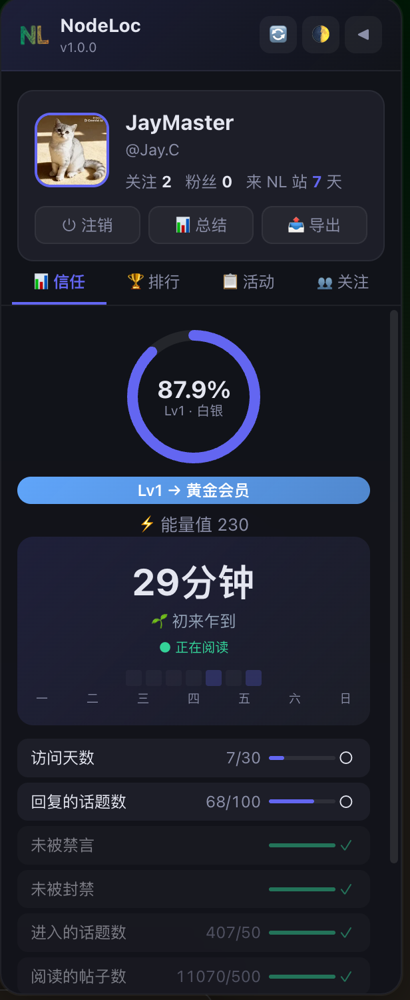

# NLStatus Pro

NodeLoc 状态增强脚本 - 信任等级追踪、阅读统计、能量值显示、排行榜、活动记录、帖子导出、AI 帖子总结

[](https://github.com/cj1071/NLStatus-Pro/releases)
[](https://opensource.org/licenses/MIT)
[](https://www.typescriptlang.org/)
[](https://vitejs.dev/)

---

## ✨ 功能特性

<table>
<tr>
<td width="50%" valign="top">

### 📊 信任等级追踪

- 实时显示当前等级和升级进度
- 详细列出所有升级条件（已达成/未达成）
- 可视化进度环形图
- 支持强制刷新（绕过 API 缓存）
- 内置信任等级说明入口：[了解论坛信任等级](https://www.nodeloc.com/t/topic/55183)

</td>
<td width="50%" valign="top">

### 📰 我的活动

- 已读、收藏、回复、点赞、话题、互动、通知 7 种类型
- **搜索功能**：关键词实时过滤
- **自动加载**：滚动到底部自动加载更多
- **固定头部**：子 Tab 和搜索栏固定，列表独立滚动

</td>
</tr>
<tr>
<td width="50%" valign="top">

### 👤 用户信息卡

- 显示头像、用户名、能量值
- 关注数、粉丝数统计
- 访问天数（与升级条件一致）
- 快捷操作：登录/注销/AI 总结/Store/导出帖子

</td>
<td width="50%" valign="top">

### 👥 关注粉丝

- 关注列表、粉丝列表切换查看
- 显示用户头像和昵称
- 点击跳转到用户主页

</td>
</tr>
<tr>
<td width="50%" valign="top">

### 📖 阅读统计

- **活跃度监听**：自动检测鼠标、键盘、滚动等操作
- **智能计时**：30 秒无操作自动暂停
- **数据持久化**：本地存储，防止丢失
- **热力图展示**：7 天阅读趋势可视化
- **阅读等级**：从「初来乍到」到「深度学习」8 个等级
- **防重复计时**：TabLeader 机制确保多标签页只计一次

</td>
<td width="50%" valign="top">

### ⚡ 导航栏能量值

- 在页面顶部导航栏实时显示能量值
- 自动刷新（每 5 分钟）
- 点击打开侧边面板

</td>
</tr>
<tr>
<td width="50%" valign="top">

### 🏆 排行榜

- **财富榜**：能量值排行（官方数据）
- **水王榜**：发帖数排行（本月/上月/全部时间）
- **文圣榜**：主题数排行（本月/上月/全部时间）
- 实时数据，来自 NodeLoc 官方 API

</td>
<td width="50%" valign="top">

### 📥 帖子导出

- 参考 LDStatusPro 的帖子导出方式
- 当前话题页支持选择楼层范围
- 支持 Markdown / HTML 导出
- PDF 通过浏览器打印保存

</td>
</tr>
<tr>
<td width="50%" valign="top">

### 🤖 AI 帖子总结

- 参考 LDStatusPro 吃瓜助手
- 当前话题页支持选择楼层范围
- 支持简略/详细总结模式
- 支持 OpenAI 兼容 API、模型和提示词配置
- 独立弹窗助手流式输出，支持 Markdown、表格、复制、字号调整、阅读模式
- 历史记录本地保存，点击历史可重新打开弹窗并继续追问

</td>
<td width="50%" valign="top">

### 🏪 NodeLoc Store

- 面板内保留快捷入口
- 新标签打开 [store.nodeloc.com](https://store.nodeloc.com/)
- 定位类似 LDStatusPro 的「士多」入口，主体交易功能由独立站点承载

</td>
</tr>
<tr>
<td width="50%" valign="top">

### 🎨 主题切换

- 自动模式（跟随系统）
- 深色模式
- 浅色模式

</td>
<td width="50%" valign="top">

</td>
</tr>
</table>

---

## 🚀 安装使用

### 1. 安装油猴插件

选择一个浏览器扩展（推荐 Tampermonkey）：

- **Tampermonkey (推荐)**
  - [Chrome](https://chrome.google.com/webstore/detail/tampermonkey/dhdgffkkebhmkfjojejmpbldmpobfkfo)
  - [Firefox](https://addons.mozilla.org/firefox/addon/tampermonkey/)
  - [Edge](https://microsoftedge.microsoft.com/addons/detail/tampermonkey/iikmkjmpaadaobahmlepeloendndfphd)
  - [Safari](https://apps.apple.com/app/tampermonkey/id1482490089)

- **Violentmonkey**
  - [Chrome](https://chrome.google.com/webstore/detail/violentmonkey/jinjaccalgkegednnccohejagnlnfdag)
  - [Firefox](https://addons.mozilla.org/firefox/addon/violentmonkey/)

### 2. 安装脚本

> **注意：** 脚本尚未发布到 Greasy Fork / OpenUserJS，目前需要手动安装。

**方式 1: 从源码构建**
```bash
# 克隆仓库
git clone https://github.com/cj1071/NLStatus-Pro.git
cd NLStatus-Pro

# 安装依赖
pnpm install

# 构建
pnpm build

# 生成的脚本在 dist/nlstatus-pro.user.js
```

**方式 2: 下载 Release**
1. 前往 [Releases](https://github.com/cj1071/NLStatus-Pro/releases) 页面
2. 下载最新版本的 `nlstatus-pro.user.js`
3. 用文本编辑器打开，复制全部内容
4. 在 Tampermonkey 管理面板点击「新建脚本」，粘贴后保存

### 3. 访问 NodeLoc

打开 [NodeLoc](https://www.nodeloc.com/)，脚本会自动运行。页面右侧会出现悬浮面板。

---

## 📸 功能截图



---

## 🛠️ 开发指南

### 技术栈
- **TypeScript 5.7** - 类型安全
- **Vite 6** - 构建工具
- **vite-plugin-monkey** - 油猴脚本打包插件
- **原生 JavaScript** - 零运行时依赖

### 项目结构
```
NLStatus-Pro/
├── src/
│   ├── main.ts              # 入口文件
│   ├── config.ts            # 全局配置
│   ├── site.ts              # 站点检测
│   ├── types.ts             # 类型声明
│   ├── data/                # 数据层：信任等级、排行榜、活动、关注
│   ├── tracking/            # 追踪统计：阅读时间追踪、通知系统
│   ├── features/            # 功能模块
│   │   ├── ai-summary/      # AI 帖子总结（模块化）
│   │   └── topic-export/    # 帖子导出（模块化）
│   ├── ui/                  # 界面组件
│   │   ├── panel/           # 主面板（逻辑、模板、外壳、渲染器）
│   │   ├── panels/          # 子面板（活动、排行榜、信任等级、关注）
│   │   ├── components/      # 通用组件（用户卡片、登录提示、Tab控制器等）
│   │   └── nav/             # 导航栏（能量值、主题切换）
│   ├── styles/              # 样式文件（模块化，13个独立CSS）
│   └── utils/               # 工具函数（通用、存储、网络、错误、日志等）
├── docs/                    # 文档（功能说明与规划）
├── dist/                    # 构建输出
├── vite.config.ts           # Vite 配置
├── tsconfig.json            # TypeScript 配置
└── package.json
```

### 本地开发

```bash
# 安装依赖
pnpm install

# 开发模式（监听文件变化自动重新构建）
pnpm dev

# 类型检查
pnpm typecheck

# 构建生产版本
pnpm build
```

### 开发流程
1. 修改 `src/` 下的源码
2. 运行 `pnpm build` 构建
3. 在 Tampermonkey 中更新脚本内容（复制 `dist/nlstatus-pro.user.js`）
4. 刷新 NodeLoc 页面测试

### 调试技巧
- 使用浏览器开发者工具（F12）查看 Console 日志
- 脚本日志前缀为 `[NLE]`
- 可以在 `src/utils/logger.ts` 中调整日志级别

---

## 🗺️ 路线图

### ✅ 已完成
- [x] 信任等级追踪与可视化
- [x] 阅读时间统计系统
- [x] 排行榜（财富/水王/文圣）
- [x] 活动记录查看与搜索
- [x] 关注/粉丝列表
- [x] 用户信息卡与快捷操作
- [x] 主题切换（深色/浅色/自动）
- [x] 信任等级说明入口
- [x] NodeLoc Store 入口
- [x] 帖子导出（Markdown/HTML/PDF 打印）
- [x] AI 帖子总结（楼层范围、流式弹窗、历史记录、继续追问）
  - 详见 [AI 帖子总结功能说明](docs/ai-summary-plan.md)

### 🚧 规划中

> 以下功能参考 [LDStatusPro](https://github.com/caigg188/LDStatusPro) 设计实现

- [ ] **云同步**：跨设备同步阅读数据（需搭建 Cloudflare Workers 后端）
  - 详见 [云同步实现计划](docs/cloud-sync-plan.md)
- [ ] **多语言支持**：英文界面

---

## 📝 更新日志

### v1.2.3 (2026-06-24)

**🔧 重构改进**
- 新增 `UrlWatcher` 通用工具类，封装 URL 变化监听逻辑
- 重构 `AITopicSummary` 和 `TopicExporter` 使用统一的 URL 监听工具
- 消除 40 行重复代码，提升代码复用性和可维护性

**🐛 Bug 修复**
- 修复导出功能在帖子间切换时不自动刷新的问题
- 修复 AI 总结在帖子间切换时不自动刷新的问题
- 修复标题过长时溢出显示问题（限制 2 行 + 省略号）
- 修复潜在的内存泄漏风险（显式 destroy 清理资源）

**⚡ 性能优化**
- 删除 main.ts 中无用的 5 秒全局轮询（节省 CPU）
- URL 监听仅在弹窗打开时启动，关闭时立即停止

**📦 技术细节**
- 新增 `src/utils/url-watcher.ts` (78 行)
- 优化 `src/features/ai-summary/index.ts` (-18 行)
- 优化 `src/features/topic-export/index.ts` (+10 行)
- 优化 `src/main.ts` (-14 行)
- 优化 `src/styles/shared.css` (+6 行)

### v1.2.2 (2026-06-24)

**🐛 Bug 修复**
- 修复导出功能 Onebox 卡片渲染问题
  - 修复 HTML 导出 Onebox 卡片左右布局显示为上下结构
  - 修复域名和标题重复显示问题
  - 精确匹配 Discourse Onebox HTML 结构提取
  - 优化 Markdown 和 HTML 导出格式一致性

**✨ 改进**
- Badge 版本号改为自动从 package.json 读取
- 优化 Onebox 卡片样式（图标尺寸、间距、布局）

### v1.2.1 (2026-06-23)

**🧹 代码质量优化**
- 删除 117 行死代码（未使用的工具函数和类）
- 消除 266 行重复 CSS（Toast/Loading/响应式样式重复定义）
- 创建统一的话题信息卡片组件 `TopicInfoCard`
- 提取 7 个共享 CSS 类（overlay-base、btn-close、topic-info 等）
- 改进错误处理：静默失败改为日志记录

**📦 构建优化**
- 构建大小：251.95 KB → 247.27 KB（-4.68 KB，-1.86%）
- CSS 架构优化：统一响应式样式到 responsive.css
- 代码净减少：-30 行（消除重复后）

### v1.2.0 (2026-06-23)

**🔧 重大重构**
- 拆分 `topicExporter.ts` (718行 → 5个模块)
  - `types.ts` - 类型定义
  - `fetcher.ts` - 数据获取 (178行)
  - `formatters.ts` - 格式转换 (311行)
  - `ui.ts` - UI渲染 (197行)
  - `index.ts` - 主协调器 (155行)
- 拆分 `aiTopicSummary.ts` (1,410行 → 7个模块)
  - `types.ts` - 类型定义
  - `config.ts` - 配置管理
  - `history.ts` - 历史记录
  - `generator.ts` - AI生成核心
  - `viewer.ts` - 查看器UI
  - `markdown.ts` - Markdown渲染
  - `index.ts` - 主协调器
- 拆分 `features.css` (1,346行 → 3个模块)
  - `ai-summary.css` - AI总结样式 (859行)
  - `topic-export.css` - 导出面板样式 (218行)
  - `shared.css` - 共享组件样式 (209行)

**🐛 Bug修复**
- 修复 @media 查询未闭合导致导出面板样式失效
- 修复缺失的导出面板样式（219行）
- 修复缺失的AI总结样式（942行）
- 移除重复的 Toast 和 Loading 样式定义
- 移除重复的 CSS 导入

**🎨 样式优化**
- `.nle-trust-guide` 字体大小调整为 10px
- AI 表单输入框 padding 优化

**📦 构建优化**
- 构建大小优化：253.12 KB → 251.95 KB
- 代码可维护性显著提升

### v1.1.0 (2026-06-19)
- ✨ 新增 AI 帖子总结功能
- ✨ 新增帖子导出功能（支持 Markdown/HTML/PDF）
- 🎨 UI 细节优化

### v1.0.3 及更早版本
- 查看 [GitHub Releases](https://github.com/cj1071/NLStatus-Pro/releases) 获取完整历史

---

## 🤝 贡献指南

欢迎贡献代码、报告 Bug 或提出新功能建议！

### 报告 Bug
在 [Issues](https://github.com/cj1071/NLStatus-Pro/issues) 页面创建新 issue，请包含：
- 问题描述
- 复现步骤
- 浏览器和油猴插件版本
- 错误截图或 Console 日志

### 提交代码
1. Fork 本仓库
2. 创建特性分支 (`git checkout -b feature/amazing-feature`)
3. 提交改动 (`git commit -m 'feat: add amazing feature'`)
4. 推送到分支 (`git push origin feature/amazing-feature`)
5. 创建 Pull Request

### 开发规范
- 使用 TypeScript，保持类型安全
- 遵循现有代码风格
- 添加必要的注释
- 确保 `pnpm typecheck` 通过
- 功能完成后测试所有 Tab 和交互

---

## 📜 许可证

[MIT License](LICENSE)

---

## 🙏 致谢

- [NodeLoc 社区](https://www.nodeloc.com/) - 提供优质交流平台
- [LDStatusPro](https://github.com/caigg188/LDStatusPro) - 功能设计参考
- [Discourse](https://www.discourse.org/) - 强大的论坛系统

---

## 📞 联系方式

- **Issues**: [GitHub Issues](https://github.com/cj1071/NLStatus-Pro/issues)
- **Discussions**: [GitHub Discussions](https://github.com/cj1071/NLStatus-Pro/discussions)

---

## ⚠️ 免责声明

本脚本为个人学习项目，仅供技术交流使用。使用本脚本产生的任何问题由使用者自行承担。

请遵守 NodeLoc 社区规则，合理使用本脚本。
